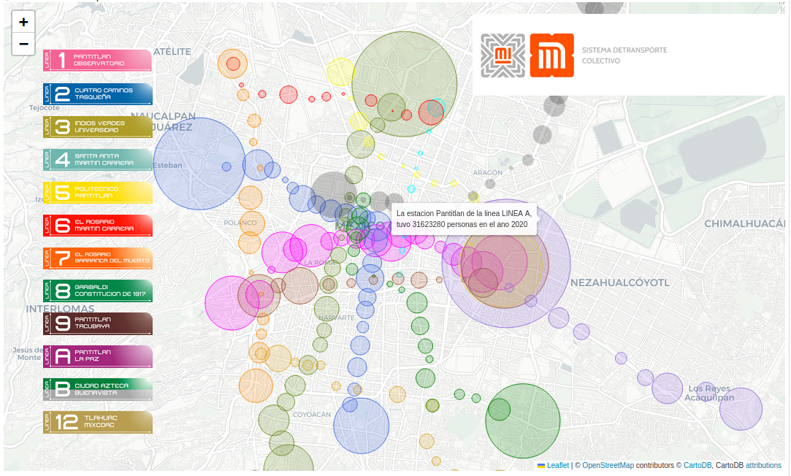

# Proyectos desarrollados

[x] Registro cambios de fase en estados metaestables
[x] Documentacion en español de OpenStreetMapX con Simulación del transito del pumabus ruta 9 de CU y mapa interactivo del metro CDMX estaciones mas concurridas
[x] Visualización de 23 años de datos de temperatura y precipitación CCH Oriente
[x] Business Model Canvas de un software inteligente de ubicación de negocios
[ ] Mascotas interactivas con Firebase Realtime

# Proyecto 1 Estados metaestables
## Objetivo: 
Registrar la temperatura del agua que inicia en un estado metaestable líquido y con un golpe cambia repentinamente a estado sólido en cuestión de segundos.
## Fecha de creación:
Noviembre 2018
## Tecnologías y herramientas utilizadas:

## Descripción:
Se utilizó un sensor digital de temperatura DS18B20 (con rango de medición -55°C hasta 125°C) y un arduino UNO para recolectar la información de temperatura en °C y el tiempo en terminos de 00:00:00.000 segundos.
Ahora, un estado metaestable fue creado colocando el sensor pegado a la tapa de una botella de agua, y esta colocada en un congelador doméstico para llegar a un superenfriamiento replicable, de este modo el agua permanece aún liquida a temperaturas bajo cero. Una vez logrado, sacamos la botella y conectamos el sensor al arduino para comenzar a recolectar datos. 
Una perturbación sobre un liquido superenfriado, en este caso una vibración en forma de un solo golpe fuerte contra la mesa provoca que el agua se congele subitamente, disminuyendo la temperatura debido al cambio de estado.

## Resultados: 
Se logró visualizar en gráficas de excel el súbito cambio de estado, además de verificar que un congelador domestico puede enfriar lo suficiente para lograrlo. 
En total se recopilaron 618 datos en 87 segundos, cada dato en un intervalo de 0.141 milisegundos.
El agua inició con una temperatura de -4.00°C, al congelarse, el calor latente provoco un aumento de temperatura hasta llegar a semi-hielo a -0.44°C.

## Notas adicionales:
Es un excelente experimento casero para la enseñanza del cambio de fase, así como apoyo en la definición de calor latente.Se puede mejorar logrando tener el liquido a temperaturas mas bajas, para lograr que una mayor porción de líquido pase a sólido, recordando que a presiones atmosféricas, la congelación se da 0°C, por lo que la temperatura orginial no fue suficiente para la cantidad de líquido en una botella.
 
# Proyecto 2 Documentacion en español de la paquetería  OpenStreetMapX

## Objetivo: 
Crear un jupyter notebook que explicara en español la paquetería OpenStreerMapX de Python, para crear y optimizar rutas, visualizaciones, imagenes y gifs
## Fecha de creación 
Junio 2023
## Tecnologías y herramientas utilizadas:

## Descripción:
Una serie de dos notebook se crearon para nformar sobre la paquetería OpenStreetMapX, como primeros pasos, por que utilizarla así como ideas para usar usarla. Utilidades básicas (Exportar mapas, insertar mapas)
Como colocar nodos, puntos y rutas.
Como crear gráficas interactivas para estadísticas por ejemplo la afluencia de estaciones del metro. Y optimización de rutas por velocidades o por vía.
Finalmente una simulación de transito.

## Resultados:

##Notas adicionales:
Estos notebooks son útiles para crear muchas mas visualizaciones, sin embargo no lo he subido a github, por lo que no esta al acceso, se espera subirlo en este mes.

# Proyecto 3 Visualización de 23 años de datos de temperatura y precipitación C>

## Objetivo:
Practicar las visualizaciones y limpieza de los datos capturados por la estación metereologica ubicada en el COlegio de Ciencias y Humanidades plantel Oriente.
 
## Descripción:
Por completar...
#Proyecto 4 Business Model Canvas de un software inteligente de ubicación de n>

